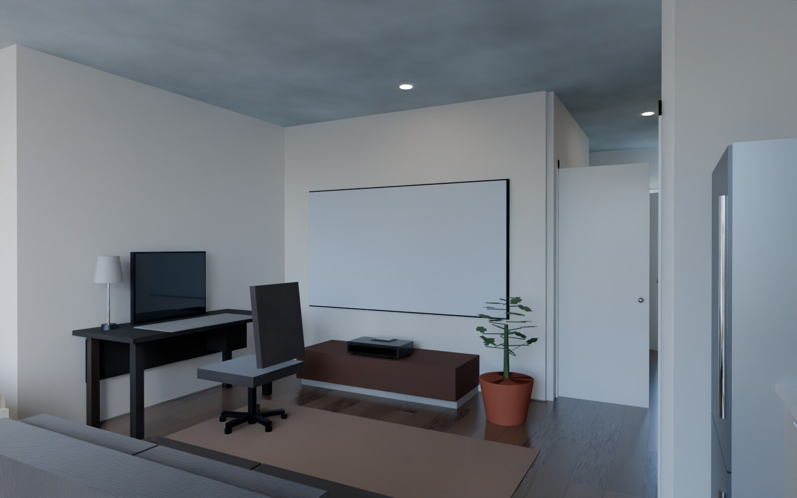
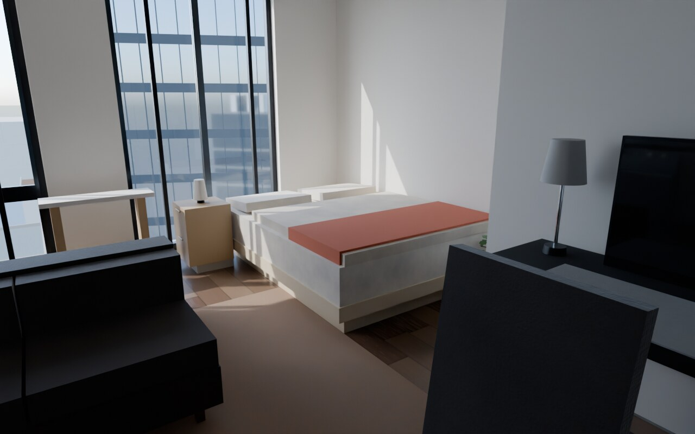
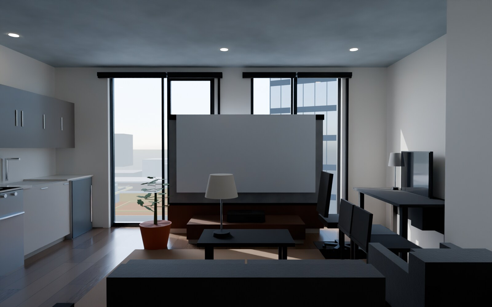
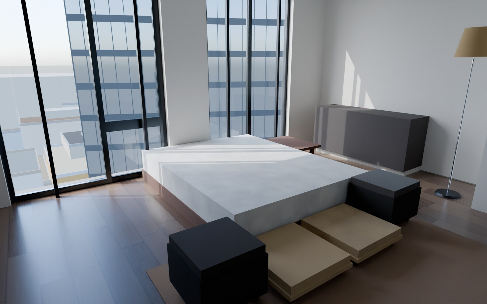
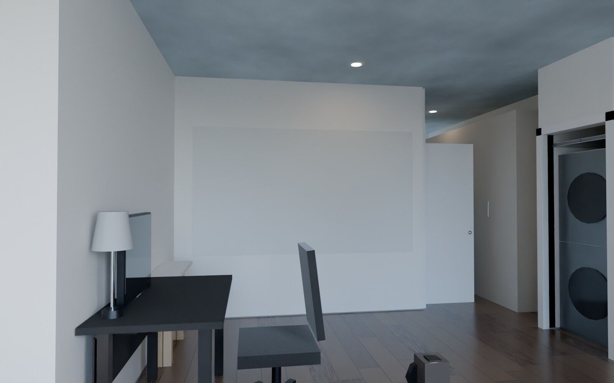
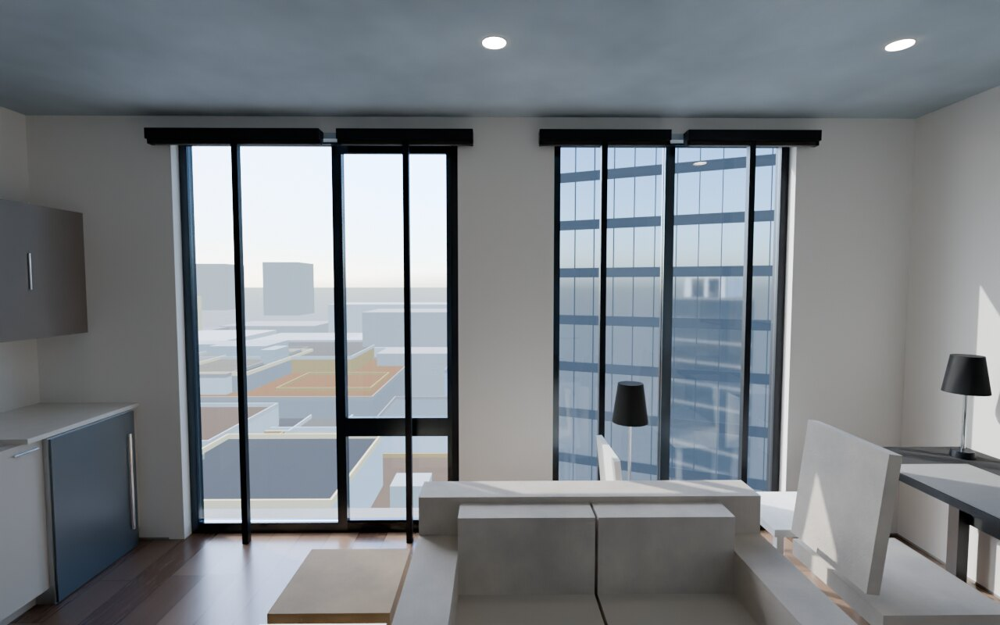
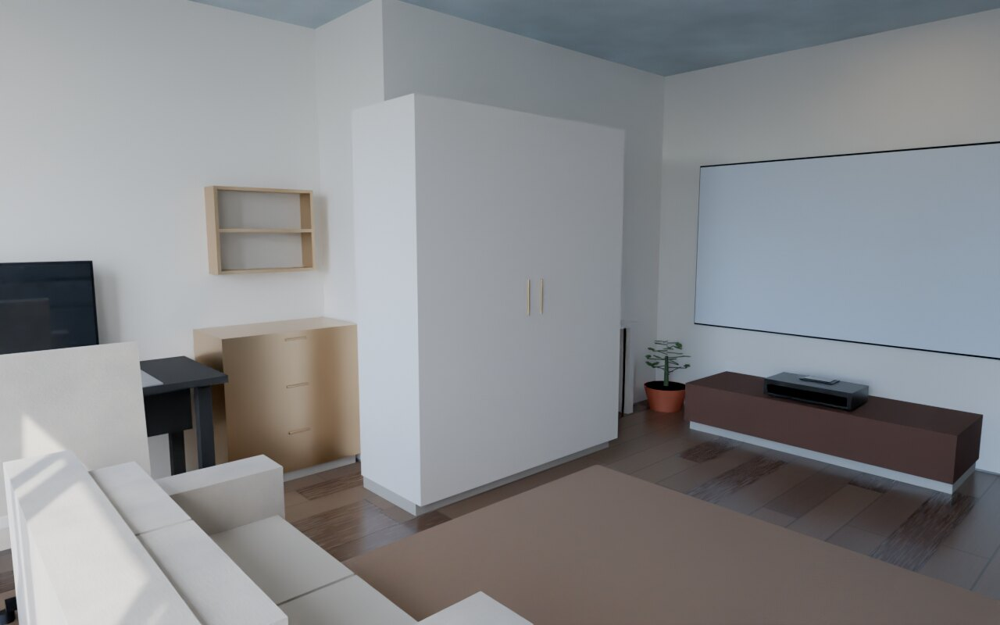
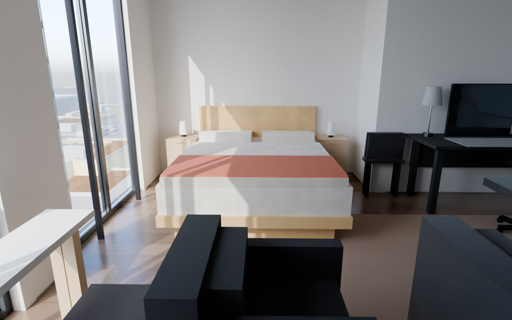
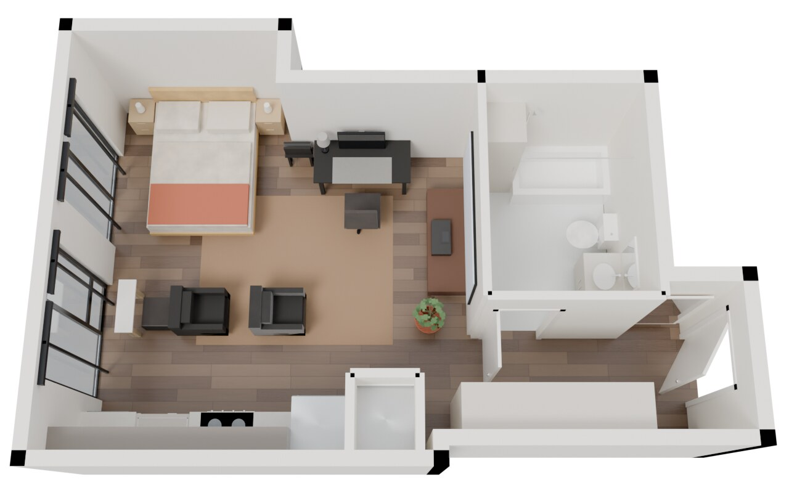
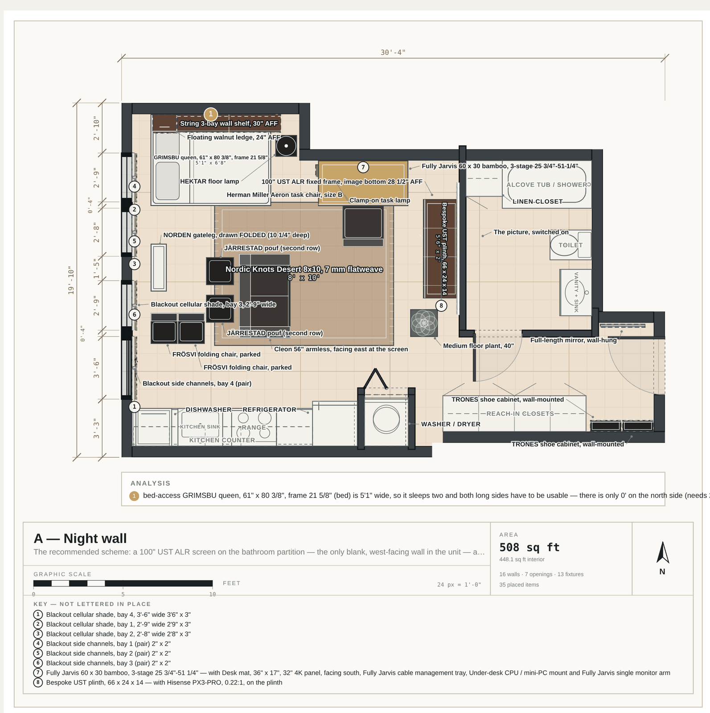

# floor_test

A to-scale design and render environment for **one real apartment**: a 508 sq ft
L-shaped studio (448 ft² inside the walls) with a single west-facing glazed wall
and an exposed concrete soffit.

The apartment is modelled once, in code. Everything else — the architectural
plan, the clearance analysis, the WebGL preview, the path-traced hero frames, the
furniture schedule and the client brief — is **generated from that one model**, so
no drawing can quietly disagree with the layout it describes.

Six schemes are designed against the same brief. All six carry the same four
hard requirements — a real queen bed, modern/minimal decor, a real Fully Jarvis
sit-stand desk, and a congregation area for watching things on a projector with
the throw geometry and the seating distances both actually correct. In five of
them what differs is **where the picture goes**, and every other decision falls
out of that; the sixth (F) holds the picture still and turns the **bed** instead.

---

## Sample renders

All frames below are GPU path-traced in Blender Cycles from the same glTF export
the WebGL preview uses, at the same 1600×1000, with a physically-scaled Nishita
sky. They are dark on purpose: blackout on all four glazing bays is a
co-requisite of every scheme (a screen face taking 500 lux of ambient sits at
1.9:1 in-room contrast — a grey rectangle), so the shades are down in the model
and the room is lit by its own downlights.

### A — Night wall

The recommended scheme. A 100" UST ALR frame on the bathroom partition — the only
blank, west-facing wall in the unit — a Hisense PX3-PRO on a 14" plinth, and a
queen head-to-the-glazing in the notch. The best picture this apartment can make;
the cost is that it is an evening room.



The sleeping end was rebuilt on 31 Jul 2026 under two rules: **nothing gets fixed
to a wall**, and the bed has to look like something. Out went a $79 white steel
frame, a wall-hung ledge and a wall-hung shelf; in came an Awara bamboo queen with
no headboard — the head of this bed is a window, so there cannot be one — oat
linen with a terracotta bed cover, an oak nightstand standing in the aisle, a
cordless Flos Bellhop on it, and four flat cases in the 8.3" under the frame doing
the job the shelf used to do. It cost $599, 1 1/8" of the walk behind the bed and
0.8° of sofa axis. It also **bought back 29.7 points of the picture**: the 5'-11"
floor lamp that used to stand at the foot of the bed was eating a third of the
screen from it, which no drawing showed and `pnpm sightline` did.



### B — Fold away

The picture goes **in the west glazing** on a floor-rising screen that stows to an
8¼" cabinet, so the view comes back when the film ends. Paid for by a queen
Murphy on the wide leg: the floor exists sixteen hours a day. The cost is a
one-ended bed and an audience facing the glass.



### C — Second row

The picture is on the bathroom partition again, but **the bed is the back row**: a
17½" Floyd queen lies head-to-the-glass across the middle of the floor, under the
46" seated-eye line, with four floor seats in front of it. Six seats, no sofa. The
cost is that the bed is public.



### D — Paint and go

118" of screen **paint** and a 2.9 lb portable that lives in a closet — an $858 AV
kit, nothing anchored, nothing framed, nothing millwork. With the projector off,
this is what you own: a faint white rectangle on a white wall. That is the point
of it, and the honest cost is a standard-throw lens standing in front of the
audience at 550 lumens, i.e. after dark only.



### E — Clear shot

Same picture as A, on the same wall, but planned around **what you can see of it**
rather than around where it goes. The desk moves into the north-west notch — the
only floor in the plate that no seat-to-screen ray crosses — and the queen goes
**onto the wall**, so for sixteen hours a day there is no bed in the apartment at
all. That frees the sofa to sit dead on the screen centreline, which none of the
first four manage. Every seat sees **100% of the picture**; the other four see 52%
to 92%. It is the only layout with no errors *and* no warnings. The costs are
$2,159 of wall bed, a floor that has to stay empty for it to land on, and dining
that is a drop-leaf for two.





### F — Headboard

The five schemes above all move the **picture** and let everything else fall out
of that. F holds the picture still and moves the **bed**: the queen is turned 90°
so its head is against the notch's north wall, which is the only way this
apartment can have a real headboard — 39" of bamboo, nine inches over the glazing
rule, legal only because the surface behind it is plaster. It buys 2'-0" of clear
floor on **both** long sides, a nightstand and a lamp on each of them, and the
disappearance of the bed-access warning layout A accepts on purpose.

It costs the sofa. A turned queen spends 7'-1⅞" of the 12'-11¼" between the notch
wall and the kitchen aisle, and after the 3'-1" east-west route the bed's own
geometry demands there is 2'-1" of depth left for seating — a Cleon is 4'-8" wide.
So the congregation stops being a sofa and becomes a **row**: two armchairs and a
pouf strung along the room's length at 39.6° / 29.6° / 25.8°. Three seats where A
has four, and the bed is no longer one of them — it faces south now and sees none
of the picture. In exchange F returns **no errors and no warnings**, a 2'-9"
narrowest route against A's 2'-6", and a worst seat at 89.2% against A's 81.9%.





### The 2D side of the same model

Same layout, same numbers, drawn to scale with dimensions, door swings, a
furniture key, a graphic scale and the analyzer's own findings marked in place:



> `renders/` is gitignored — every PNG, SVG and GLB in it is regenerable from the
> layouts and the plan, which *are* committed. The images above are a small,
> deliberate copy kept in `docs/renders/` so this page works on GitHub.

---

## The unit

| | |
|---|---|
| Plan | `studio-508`, 30'-4" × 19'-10" overall, L-shaped |
| Area | 508 ft² gross · **448 ft² interior** |
| Glazing | one west wall, four bays (2'-8¾", 2'-8¼", 2'-9¼", 3'-6") |
| Soffit | exposed structural concrete — no ceiling mounting anywhere, in any scheme |
| Ceiling | 9'-0", **assumed** (not on the source plan) |
| Source | traced from the listing graphic at 28.587 px/ft — treat all coordinates as **±0.3 ft** |

Where the trace disagreed with a real manufactured size, the real size wins and
the substitution is recorded in `PLAN_NOTES` (`src/core/plan.ts`) — twelve entries
saying exactly what is measured and what is inferred. `data/reference/` holds the
photograph of the real living/west corner that the material table is calibrated
against, so the renders' finishes are matched to the unit rather than invented.

---

## The six schemes

| | Layout | Where the picture goes | The cost |
|---|---|---|---|
| **A** | `a-night-wall` | 100" UST ALR frame on the bathroom partition | an evening room, and no dresser |
| **B** | `b-fold-away` | floor-rising screen in the west glazing | one-ended Murphy bed, audience faces the glass |
| **C** | `c-second-row` | bathroom partition, with the bed as the back row | the bed is public |
| **D** | `d-paint-and-go` | 118" of screen paint, portable projector | 550 lumens and a lens in front of the audience |
| **E** | `e-clear-shot` | bathroom partition again, but planned around the SIGHTLINE | a wall bed and a floor that must stay empty for it |
| **F** | `f-headboard` | same as A — F moves the BED, not the picture | the sofa, and the bed stops being a seat |

**E is the one to read first if you only read one.** The first four were drawn
around where the picture goes; E was drawn around what you can actually see of
it. `scripts/sightline.ts` casts a grid of rays — five eye positions per seat
against 169 points on the image — instead of the single seat-centre-to-screen-centre
ray `analysis.ts` uses, and it turns out every earlier scheme is obstructed:

```
  a-night-wall   sofa 92.0%   poufs 86.6% / 89.7%   bed 81.9%
  b-fold-away    worst seat 79.5%
  c-second-row   worst seat 89.0%
  d-paint-and-go worst seat 91.8%
  e-clear-shot   every seat 100.0%
  f-headboard    row 97.2% / 91.6% / 89.2%
```

In A, B, C and D the main culprit is the parked desk chair. A's bed used to read
52.2% here, and the difference is one object: a floor lamp parked in the shoulder
at the foot of the bed, which the layout file asserted was "out of every
seat-to-screen sightline" and which was in fact eating 33.8% of the picture. It is
now a 23 1/2" plant, and 23 1/2" cannot cross a ray whose lowest point is 28 1/2". E moves the desk into
the north-west notch — the only floor in the plate that no seat-to-screen ray
crosses — and puts a headboard-less queen out in the room under the 28 1/2" image
bottom, which frees the sofa to sit dead on the screen centreline for the first
time. It is also the only layout that returns no errors *and* no warnings.

Live figures — item counts, free floor, narrowest circulation path, warnings and
budget — come out of `pnpm check`, which is also the CI gate: it exits 1 if any
layout has an error-severity issue (things overlap, a door cannot open, a route is
impassable). Sample output:

```
  LAYOUT          ITEMS  FREE %  FREE AREA  NARROWEST  ERR  WARN   BUDGET
  ──────────────  ─────  ──────  ─────────  ─────────  ───  ────  ───────
  a-night-wall       39   78.5%    352 ft²       2'6"    0     1  $16,717
  b-fold-away        34   82.8%    371 ft²         3'    0     3  $16,596
  c-second-row       28   79.5%    356 ft²       3'6"    0     2  $11,573
  d-paint-and-go     26   83.6%    375 ft²       2'6"    0     1   $7,357
  e-clear-shot       37   85.0%    381 ft²      2'10"    0     0  $12,733
  f-headboard        40   80.3%    360 ft²       2'9"    0     0  $16,089

  6 layouts · 448 ft² interior · walkway min 3' (tight 2'6")
  no errors, 7 warnings, 4 info
```

`BUDGET` is the catalogue total only. `src/core/budget.ts` additionally produces
an **all-in band** — furniture plus low/high allowances for every real cost with
no catalog page (mattresses, slatted bases, level-5 plastering, freight) — and it
flags which prices in the schedule are unverified rather than quoted.

---

## Getting started

```bash
pnpm install
pnpm check          # analyze all six layouts; exits 1 on an error-severity issue
pnpm sightline      # how much of the projected image each seat can actually see
pnpm dev            # the interactive lab at http://localhost:4317
```

## The pipeline

`data/source-plan.json` is the raw trace and is not imported by anything —
`src/core/plan.ts` is the authoritative model derived from it by hand, which is
where the twelve `PLAN_NOTES` substitutions get made.

```
  src/core/plan.ts          src/core/catalog.ts
  (the apartment)           (169 furniture defs)
          └───────────────┬───────────────┘
                          ▼
                  src/layouts/*.ts                  the six schemes
                          │
    ┌─────────────────────┼─────────────────────┐
    ▼                     ▼                     ▼
 analysis.ts          render2d/            render3d/build.ts
 clearances,          to-scale SVG         one three.js scene
 door swings,         plan + PNG           ├─► WebGL preview + PNG
 circulation,         capture              └─► .glb ─► Blender Cycles
 sightlines,              │                        │
 throw geometry           │                        ▼
    │                     │                 path-traced frames
    ▼                     │                        │
 pnpm check               │                        │
    └─────────────────────┴────────────────────────┘
                          ▼
                   scripts/brief.ts
            one self-contained HTML per layout
```

| Command | What it does |
|---|---|
| `pnpm dev` | the interactive lab — layout picker, 2D/3D views, camera and theme presets, live analysis, item schedule, catalog browser |
| `pnpm check` | clearance / collision / circulation report. `--json` for machine-readable, `--quiet` for the summary table only |
| `pnpm svg` | to-scale architectural plan as SVG (vector, diffable, prints) |
| `pnpm render` | headless PNGs of the 2D plan and the WebGL 3D view — how an agent looks at its own work |
| `pnpm glb` | export the three.js scene as `.glb`; the only thing Blender ever sees |
| `pnpm raytrace` | GPU path-traced hero frames in Blender Cycles (Nishita sky, real sun disc, per-camera exposure bias) |
| `pnpm brief` | one self-contained HTML brief per layout: hero frame, plan, reasoning, schedule, analyzer verdict |
| `pnpm typecheck` | `tsc --noEmit` |

Reproducing the frames on this page:

```bash
npx tsx scripts/raytrace.ts --layout a-night-wall   --camera eye-window --res 1600x1000 --samples 200 --exposure 2.2
npx tsx scripts/raytrace.ts --layout a-night-wall   --shots  sleeping   --res 1280x800  --samples 220
npx tsx scripts/raytrace.ts --layout f-headboard    --shots  all        --res 1280x800  --samples 200
npx tsx scripts/raytrace.ts --layout b-fold-away    --camera eye-living --res 1600x1000 --samples 200 --exposure 2.2
npx tsx scripts/raytrace.ts --layout c-second-row   --camera eye-hero   --res 1600x1000 --samples 256 --exposure 2.9
npx tsx scripts/raytrace.ts --layout d-paint-and-go --camera eye-window --res 1600x1000 --samples 200 --exposure 2.2
npx tsx scripts/render.ts   --view 2d
```

`raytrace` expects Blender at `~/.local/opt/blender/blender` (override with
`BLENDER=/path/to/blender`) and prefers OptiX, falling back to CUDA. The headless
2D/3D renderer needs no GPU: it boots vite in-process on an OS-assigned port and
drives Chromium with software WebGL, so `pnpm render` works in a container.

## Repo layout

```
src/core/        the apartment, the catalog, the units, the analyzer, the money
src/layouts/     the six schemes — one file each, plus faces.ts for shared datums
src/render2d/    to-scale plan: SVG writer + React view
src/render3d/    three.js scene builder, materials, camera presets, city backdrop
src/app/         the interactive lab, and the chrome-less capture mode scripts drive
scripts/         CLI drivers (check, svg, render, glb, raytrace, brief)
scripts/blender/ Cycles render script, physically-based material table, sky/world
data/            traced source plan + the reference photograph
docs/renders/    the committed sample images used by this README
```

## Conventions worth knowing before you edit

- **Decimal feet everywhere** internally; `src/core/units.ts` owns every
  real-world clearance minimum and all feet-and-inches formatting.
- **Every number carries its provenance.** Catalog entries have a `source` string
  that says where the price and the dimensions came from, and says so plainly when
  a price is an estimate rather than a quotation. Layout files argue their
  trade-offs in prose next to the geometry that implements them.
- **Shared datums live in `src/layouts/faces.ts`.** If two layouts cite the same
  wall face or the same desk-orientation rule, neither of them owns it.
- **`src/render3d/build.ts` is the single source of truth for the 3D model.** The
  WebGL preview, the `.glb` and every path-traced frame come from that one scene
  graph, and the ray tracer computes its camera with the same `cameraFor()` the
  preview uses — so a hero frame and a preview frame of the same layout frame the
  unit identically.
- **Generated output is not committed** (`renders/`, `briefs/`, `tmp/`). If you
  need a picture in the repo, put a deliberate copy in `docs/`.
